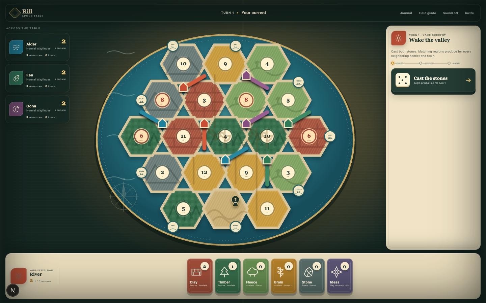
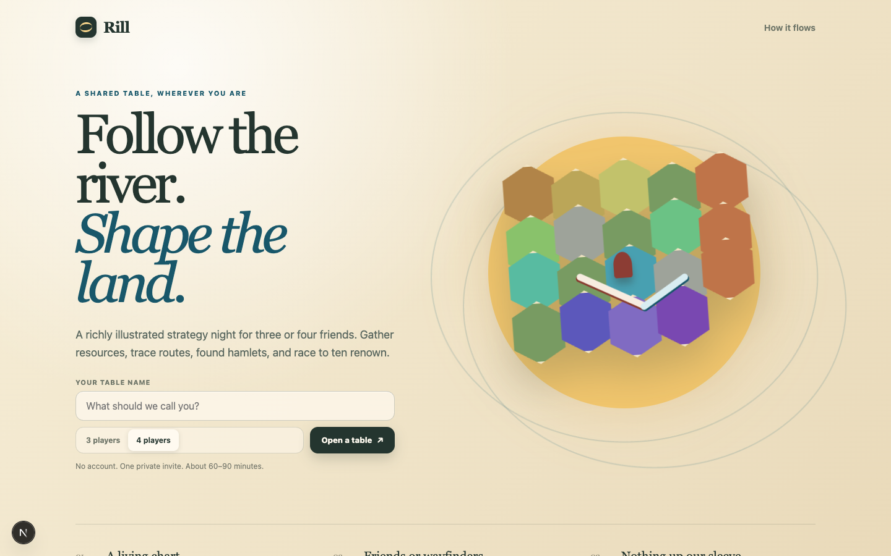
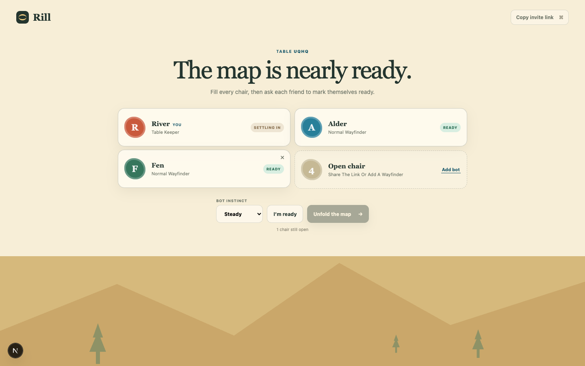
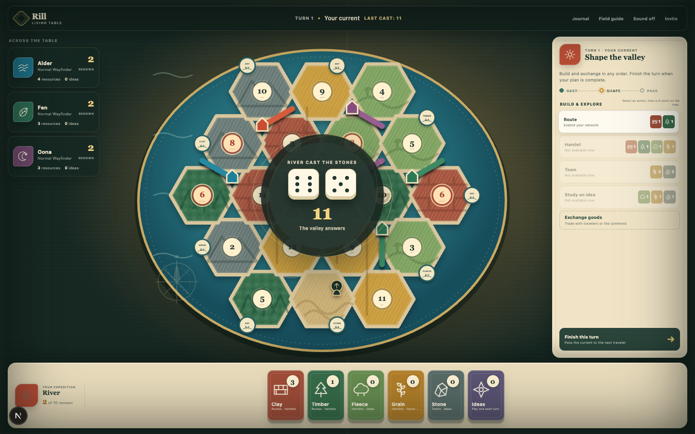

<div align="center">
  
  <h1>Rill</h1>
  <p><strong>A living online strategy table for friends and wayfinders.</strong></p>
  <p>Create a room, share one link, and shape a richly illustrated valley together—no accounts or setup ceremony.</p>

  <p>
    <a href="https://github.com/rootsec1/katan/actions/workflows/ci.yml"></a>
    <a href="https://bun.sh"></a>
    <a href="https://nextjs.org"></a>
    <a href="./LICENSE"></a>
  </p>
</div>

<br>



## Why Rill

- **One-link multiplayer.** Create an unlisted room for three or four players and invite friends without accounts.
- **Humans and wayfinders.** Fill any chair with deterministic Easy, Normal, or Hard bots; disconnected players can be replaced and later reclaim their seat.
- **A complete rules authority.** The framework-independent engine owns setup, production, trading, building, development cards, the waystone, awards, and victory.
- **A board that explains itself.** Legal targets glow, build costs use readable resource icons, disabled actions explain why, and the turn compass always shows what happens next.
- **Live, observable play.** Dice, bot decisions, trades, builds, awards, chat, and connection changes arrive as ordered events instead of silent state jumps.
- **Private by construction.** Hands, deck order, theft results, and RNG state stay server-side; every connection receives a personalized redacted view.

## The experience

<table>
  <tr>
    <td width="50%"></td>
    <td width="50%"></td>
  </tr>
  <tr>
    <td align="center"><strong>Gather in seconds</strong><br><sub>Choose a table size and share a private invite.</sub></td>
    <td align="center"><strong>Fill every chair</strong><br><sub>Mix friends with three levels of wayfinder.</sub></td>
  </tr>
</table>



## Built for trustworthy play

Rill is a single Next.js application with a pure TypeScript game domain. The UI and bots consume the same `LegalActions`; neither duplicates rules. Commands are validated, idempotent, and applied with compare-and-swap room revisions before an ordered event is written.

```text
Browser (personalized PlayerView)
  ├─ HTTP room creation, joining, and recovery
  └─ native WebSocket command + event cursor
                         │
                  validated command
                         │
              CAS repository + bot lease
                         │
        immutable rules engine ── LegalActions
                         │
            private GameState in libSQL
```

| Layer | Choice |
| --- | --- |
| Application | Next.js 16.2 App Router, React 19, TypeScript |
| Runtime | Bun 1.3.11 for install, development, tests, scripts, and builds |
| Game surface | Semantic layered SVG, CSS Modules, Web Animations API |
| Persistence | Drizzle ORM with local SQLite or remote Turso/libSQL |
| Realtime | Native WebSockets with ordered cursor recovery over HTTP |
| Validation | Zod at every command boundary |
| Verification | Bun test, fast-check, deterministic bot simulations, Playwright |

Read the full [architecture](./docs/architecture.md), [rules scope](./docs/rules.md), and [design system](./DESIGN.md).

## Run locally

### Requirements

- [Bun 1.3.11](https://bun.sh)
- A modern Chromium, Firefox, or Safari browser

```bash
git clone git@github.com:rootsec1/katan.git
cd katan
cp .env.example .env.local
bun install --frozen-lockfile
bun run db:migrate
bun run dev
```

Open [http://localhost:3000](http://localhost:3000). Plain Next.js development uses the resilient HTTP event fallback; use `bun run dev:realtime` when testing Vercel-native WebSocket upgrades locally.

### Environment

```dotenv
DATABASE_URL=file:./data/rill.db
DATABASE_AUTH_TOKEN=
SESSION_SECRET=replace-with-at-least-32-random-characters
NEXT_PUBLIC_APP_URL=http://localhost:3000
```

Local development uses SQLite through libSQL. Vercel deployments must use a remote Turso database because function filesystems are not durable. See the [deployment guide](./docs/deployment.md).

## Development

| Command | Purpose |
| --- | --- |
| `bun run dev` | Start Next.js with Bun |
| `bun run dev:realtime` | Start Vercel-compatible realtime development |
| `bun run lint` | Run ESLint |
| `bun run typecheck` | Check TypeScript |
| `bun test` | Run engine and repository tests |
| `bun run test:e2e` | Run Playwright acceptance tests |
| `bun run simulate 100` | Soak-test deterministic bot games |
| `bun run build` | Create a production build |
| `bun run db:generate` | Generate a Drizzle migration |
| `bun run db:migrate` | Apply pending migrations |
| `bun run cleanup` | Remove expired rooms |

## Contributing

Contributions are welcome. Start with [CONTRIBUTING.md](./CONTRIBUTING.md) and keep these boundaries intact:

1. Rules belong in `src/game`, never in React components or bots.
2. Private `GameState` must never cross a route boundary.
3. Use Bun for every repository workflow.
4. Add focused tests for every rules or security change.
5. Keep all names, artwork, sounds, and copy original.

## Independence and release boundary

Rill is an independent project. It is not affiliated with, endorsed by, or licensed by CATAN GmbH or CATAN Studio. It uses original code, artwork, copy, terminology, and synthesized sound. Obtain independent trademark and intellectual-property review, plus any required permission, before a public launch.

## License

Original repository code and assets are available under the [MIT License](./LICENSE).
